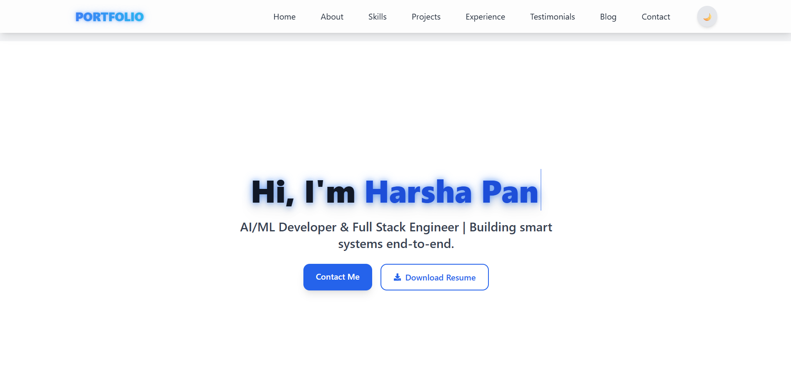

# 🚀 Personal Portfolio Website


> ✨ A stunning and professional personal portfolio website built using **React**, **Tailwind CSS**, and **Framer Motion**. This site highlights your skills, experience, and projects in a sleek, animated, and responsive interface.

---

## 📸 Live Demo

🌐 [Click here to view live demo](https://adarsh1306-portfolio.vercel.app/)

---

## 🖼️ Screenshots

### 🔷 hero + About Section  



### 🛠️ Skills Section  


### 📂 Projects Section  


### 🧩 Experience Timeline  


---

## 🧩 Key Features

✅ Responsive design for all devices  
✅ Light/Dark mode toggle ☀️🌙  
✅ Animated transitions using Framer Motion  
✅ Projects with live demo & GitHub links  
✅ Experience timeline with connected path  
✅ Testimonials and blog sections  
✅ Contact form with social icons  
✅ Glowing effects on headings and logo  
✅ Fully customizable via React components

---

## 🔧 Tech Stack

| Tech       | Description                   |
|------------|-------------------------------|
| React JS   | UI library for component-based development |
| TailwindCSS | Utility-first CSS framework    |
| Framer Motion | Powerful animation library     |
| React Icons  | Icon library used for social and UI icons |

---

## 🛠️ Installation & Setup

Follow the steps below to set up the project locally:

```bash
# 1️⃣ Clone the repository
git clone https://github.com/Adarsh130/Portfolio.git
cd Portfolio

# 2️⃣ Install dependencies
npm install

# 3️⃣ Start development server
npm run dev

# 4️⃣ Open your browser
http://localhost:5173/
```

---

## 🗂️ Folder Structure

```
Portfolio/
├── public/               # Static files
│   └── assets/           # Images and icons
├── src/
│   ├── components/       # All section components
│   ├── App.jsx
│   ├── main.jsx
│   └── index.css
├── tailwind.config.js
├── vite.config.js
├── package.json
└── README.md
```

---

## 🔗 Social Links

Connect with me:

- 🔗 [GitHub](https://github.com/Harsha-pandey9)
- 💼 [LinkedIn](https://linkedin.com/in/harsha-pandey-399025234)
- 📸 [Instagram](https://instagram.com/your_username)
- 🐦 [Twitter](https://twitter.com/your_username)
- ✉️ Email: harshapandey2004@gmail.com

---

## 📜 License

This project is open source under the [MIT License](LICENSE).

---

## 🙌 Acknowledgements

- [React](https://react.dev/)
- [Tailwind CSS](https://tailwindcss.com/)
- [Framer Motion](https://www.framer.com/motion/)
- [heroicons & React Icons](https://react-icons.github.io/react-icons/)

---

## 🧠 Contributing

Pull requests are welcome! Feel free to fork and improve this portfolio.

```bash
# Fork it
# Create your feature branch: git checkout -b my-new-feature
# Commit your changes: git commit -am 'Add some feature'
# Push to the branch: git push origin my-new-feature
# Submit a pull request
```
